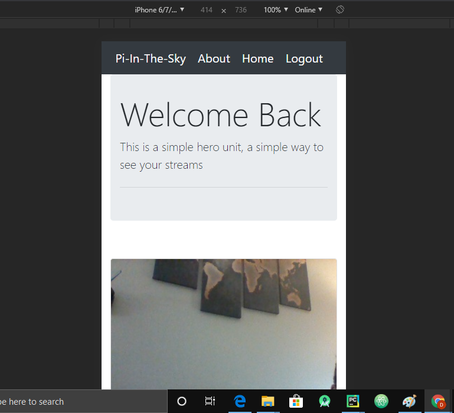
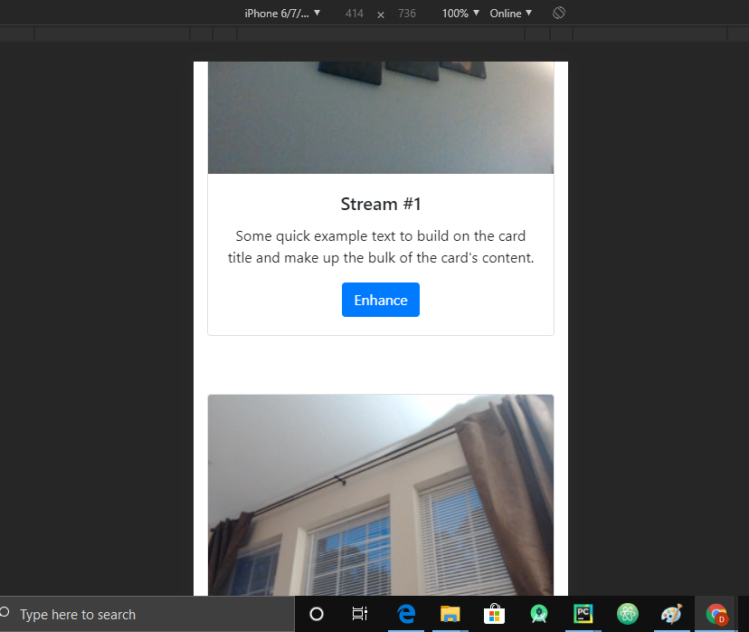

# PiInTheSky

 Python Based Network Security Camera Suite
 
 ##
 
 This project utilizes the flask web framework to allow for network access to your connected cameras. Cameras  as simple as usb webcams can be connected with opencv and their video frames to be streamed for viewing by connected users.
 
 ##
 
 Usage: 
 
###
1. create python 3.6~ environment. 
 
 
###
2. run "pip install -r reqs.txt"

###
3. connect 1-3 usb web cameras

* note , you can add more cameras through directly manipulating the code with opencv, cameras generators, and html img objects to render their frames

###
4. run the program

###
5. develop future features as you wish

####
future improvements:

	secure signup
	
	secure login
	
	2FA
	
	motion detection
	
	computer vision detection
	
	notifications
	
	

* ie integrate  sqlalchmey for login, or further web responsiveness

 
 

 
 

 
 

